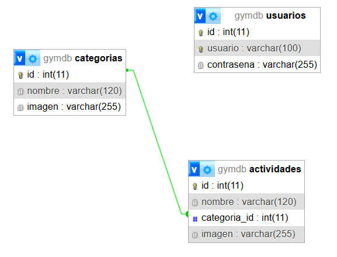

# Station Gym - TPE Web 2

## Integrantes

-   Gamondi Samuel (samuelgamondi01@gmail.com)
-   Rivarola Facundo Uriel (rivarolauriel2002@gmail.com)

## Temática

Sitio web dinámico de un gimnasio donde se listan **actividades**
clasificadas por **tipos**.
El usuario general puede navegar la información, mientras que el
administrador puede gestionarla mediante un panel protegido con login.

## Funcionalidades

### Sección pública

-   Listado de **tipos**.
-   Listado de **actividades**.
-   Actividades por tipo.
-   Detalle de actividad.
-   Visualización de imágenes por URL.

### Sección administrativa

-   Login y logout.
-   ABM de **tipos**.
-   ABM de **actividades**.
-   Usuario inicial:
    -   **Usuario:** webadmin\
    -   **Contraseña:** admin

## Arquitectura (MVC)

### Modelos (`app/models/`)

-   `TipoModel`: operaciones sobre la tabla `tipos`.
-   `ActividadModel`: operaciones sobre `actividades`.
-   `UsuarioModel`: login y validación.

### Controladores (`app/controllers/`)

-   `PublicController`: navegación pública.
-   `AdminController`: ABM y panel.
-   `AuthController`: login/logout.

### Vistas (`app/views/`)

-   `views/public/` -- parte pública.
-   `views/admin/` -- sección administrativa.
-   `views/auth/` -- login.
-   `views/partials/` -- header/footer reutilizables.

### Router

`index.php` analiza la URL y deriva al controlador correspondiente.

------------------------------------------------------------------------

## Instalación

1.  Copiar la carpeta `station-gym/` en el servidor local.
2.  Crear una base de datos vacía.
3.  Importar `database/gymdb.sql`.
5.  Ingresar a:
    -   Público: `http://localhost/station-gym/`
    -   Admin: `http://localhost/station-gym/admin` (Usuario: webadmin Constraseña: admin).

------------------------------------------------------------------------

## DER

    usuarios
    --------
    id (PK)
    username
    password_hash
    nombre
    rol

    tipos
    --------
    id (PK)
    nombre

    actividades
    --------
    id (PK)
    nombre
    descripcion
    imagen
    tipo_id (FK → tipos.id)
    created_at

Relación: **Un tipo → muchas actividades**.

------------------------------------------------------------------------

## Archivo SQL

Incluido en la carpeta `database/` como `gymdb.sql`.
